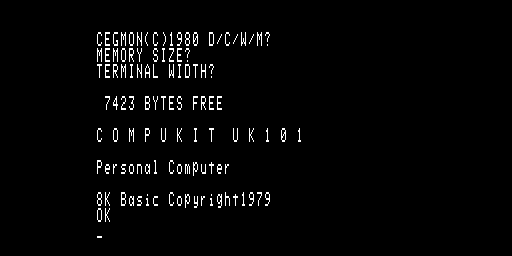

# UK101 på Olimex Neo6502

En Compukit UK101 som kör på Neo6502-kortets **riktiga W65C02S**, med RP2040:n
som minne, video och tangentbord.

Neo6502 är byggt så att RP2040:n svarar på varje bussåtkomst från processorn ur
en 64 KB-array i sitt eget RAM. Det gör en UK101 nästan gratis: maskinen är
6502 + 1 KB skärm-RAM + tangentmatris + ACIA, och allt utom matrisen är ren
minnesåtkomst.



Bilden är inte fotograferad, den är renderad av `uk101gui.exe` genom
originalets teckengenerator.

Projektet har två byggmål som delar samma maskinmodell:

| Mål | Vad | Läge |
|-----|-----|------|
| `host\` | UK101-modellen mot en **emulerad** 6502, körs på PC | verifierad, se nedan |
| `pico\` | UK101-modellen mot den **riktiga** 65C02:an på Neo6502 | bygger, ej körd på hårdvara |

Värdmålet ger två program:

| Program | Vad |
|---------|-----|
| `uk101gui.exe` | interaktiv maskin i ett fönster, riktiga pixlar ur teckengeneratorn |
| `uk101host.exe` | skriptad provrigg, headless, skriver ut skärmen som text |

Poängen med uppdelningen är att `src\uk101.c` är exakt samma kod i båda. Minneskarta,
ROM-skydd, ACIA och tangentmatris är alltså verifierade på PC innan de rör hårdvara.
Det enda som skiljer är vem som kör 6502-cyklerna, och vad som ritar skärmen.

## Läge

**Verifierat på PC.** CEGMON bootar, BASIC kallstartar, tangentbordet svarar och
program körs:

```
 2  |            8K Basic Copyright1979                              |
 3  |            OK                                                  |
 4  |            10 FOR I=1 TO 5                                     |
 5  |            20 PRINT I;I*I                                      |
 6  |            30 NEXT I                                           |
 7  |            RUN                                                 |
 8  |             1  1                                               |
 9  |             2  4                                               |
10  |             3  9                                               |
11  |             4  16                                              |
12  |             5  25                                              |
13  |                                                                |
14  |            OK                                                  |
```

Teckenavkodningen är verifierad på riktiga pixlar, inte bara som text.
`uk101gui.exe --shot fil.bmp` renderar utan att öppna fönster, vilket gör att
bilden går att granska. Både fönstret och pico-firmwaren går genom samma
`uk101_glyph_row()` i `src\uk101.h`, så det som syns på PC är samma avkodning
som kortet gör.

**Ej verifierat.** Pico-firmwaren kompilerar och länkar men har aldrig körts på
ett kort. DVI-uppsättningen, USB-tangentbordet och PIO-klockdelaren är skrivna
efter Neo6502-firmwarens och PicoDVI:s egna, beprövade kod, men de är inte
provade här. Det som *är* prövat av firmwarens innehåll är maskinmodellen och
teckenavkodningen, alltså det som delas med värdmålet.

## Fällan som är värd att känna till

CEGMON:s resetvektor på `$FFFC` pekar på `$FF00`, och där ligger riktig kod:

```
$FF00: D8        CLD
$FF01: A2 28     LDX #$28
$FF03: 9A        TXS
$FF04: 20 A6 FC  JSR $FCA6
```

`$FF00-$FF0F` är samtidigt Neo6502-firmwarens kontrollport, alltså adressen där
6502:an anropar RP2040:ns API. En UK101 kan därför inte samexistera med det
API:t. Här är det löst genom att inte använda API:t alls: firmwaren i `pico\` är
egen och har ingen kontrollport. Bygger du istället vidare på
Olimex/Robsons firmware måste porten flyttas (dokumentationen säger att den är
flyttbar), annars kraschar maskinen på första instruktionen efter reset.

## Minneskarta

Originalets adressrum, med RP2040:n som avkodare. Sidklassen slås upp i en tabell
med en post per 256-bytessida, vilket är allt som hinns med per bussåtkomst.

| Adress | Klass | Innehåll |
|--------|-------|----------|
| `$0000-$1FFF` | RAM | 8 KB arbets-RAM, originalets maximala påbyggnad |
| `$2000-$9FFF` | öppen | ingen krets, läser `$FF` |
| `$A000-$BFFF` | ROM | 8 KB Microsoft BASIC |
| `$C000-$CFFF` | öppen | |
| `$D000-$D3FF` | RAM | 1 KB skärm-RAM, 64x16 tecken |
| `$D400-$DEFF` | öppen | |
| `$DF00-$DFFF` | tangentbord | radval skrivs, kolumner läses |
| `$E000-$EFFF` | öppen | |
| `$F000-$F7FF` | ACIA | MC6850, `$F000` status/kontroll, `$F001` data |
| `$F800-$FFFF` | ROM | 2 KB CEGMON, inklusive vektorerna |

ROM-skyddet är inte kosmetiskt. Neo6502 ger 6502:an platt RAM, och BASIC:ens
`MEMORY SIZE?`-avsökning skriver uppåt i minnet tills den slutar få tillbaka vad
den skrev. Utan skydd hade den skrivit sönder sitt eget ROM.

## Tangentbordet

Matrisen är originalets 8x8, aktiv låg, och radvalet får peka ut flera rader
samtidigt eftersom monitorn avsöker så.

Vilket **tecken** en position ger är CEGMON:s sak, inte hårdvarans. Istället för
att gissa layouten är tabellen i `src\uk101_keys.h` **uppmätt**: varje position
trycktes vid BASIC-prompten, med och utan shift, och tecknet på skärmen lästes av.
Kör om mätningen med `calibrate`, se nedan.

Mätningen visade tre saker som en gissad layout hade fått fel:

- **Shift på en bokstav ger ASCII + `$10`, inte gemener.** Shift Lock ligger nere
  från start, så versaler får man utan shift. Därför går bara gemenerna `a-j` att
  skriva alls, och det spelar ingen roll: BASIC förstår ändå bara versaler.
- Tangenten som Searles PS/2-mappning kallar `-` ger i själva verket `:`, och med
  shift `*`. Den han kallar `=` ger `-`, och med shift `=`. Det är originalets
  `: *` och `- =`.
- Positionerna rad 5 bit 4 och rad 6 bit 1 ger ingenting. CEGMON har ingen post
  för dem.

Pico-firmwaren går inte via matrispositioner utan via tecken: HID-koden blir det
tecken användaren menade, och tecknet slås upp i tabellen. Skriver du `"` på ditt
USB-tangentbord får du `"` på UK101:an, oavsett var den låg 1979.

## Bygga

Förutsätter MSYS2 i `C:\msys64`. Verktygen installeras med

```powershell
C:\msys64\usr\bin\pacman.exe -S --needed mingw-w64-ucrt-x86_64-gcc mingw-w64-ucrt-x86_64-cmake mingw-w64-ucrt-x86_64-ninja mingw-w64-ucrt-x86_64-arm-none-eabi-gcc mingw-w64-ucrt-x86_64-arm-none-eabi-newlib mingw-w64-ucrt-x86_64-SDL2
```

SDL2 behövs bara till det interaktiva fönstret. Saknas den byggs resten ändå,
byggskriptet hoppar över `uk101gui.exe` och säger till.

Hämta beroendena, pico-sdk och PicoDVI, till `vendor\`:

```powershell
powershell -ExecutionPolicy Bypass -File tools\hamta-beroenden.ps1
```

Bygg sedan båda målen:

```powershell
powershell -ExecutionPolicy Bypass -File tools\bygg.ps1
```

`tools\bygg.ps1 -Bara host` bygger bara värdharnesset, `-Bara pico` bara
firmwaren, `-Ren` river byggkatalogen först.

### Två versionskrav som kostar en kvart att lista ut

- **pico-sdk måste vara 2.2.0 eller senare.** I 2.1.1 saknar `tools/pioasm/output_format.h`
  sitt `#include <cstdint>`, och med GCC 13 och uppåt bygger inte pioasm.
- **arm-none-eabi-binutils måste vara 2.44 eller äldre.** Från 2.45 avvisar `ld`
  att samma länkskript förekommer två gånger, och pico-sdk skickar
  `default_locations.ld` både med `--script=` och via `INCLUDE` i
  `memmap_default.ld`. Felet ser ut så här:

  ```
  ld.exe: error: linker script file '...memmap_default.ld (...default_locations.ld)'
  appears multiple times
  ```

  Nedgradera med

  ```powershell
  C:\msys64\usr\bin\pacman.exe -U https://repo.msys2.org/mingw/ucrt64/mingw-w64-ucrt-x86_64-arm-none-eabi-binutils-2.43.1-1-any.pkg.tar.zst
  ```

  Kommer en `pacman -Syu` och uppgraderar tillbaka, gör om nedgraderingen.

## Köra maskinen på PC

```powershell
cd host
.\uk101gui.exe --roms ..\roms
```

Ett fönster öppnas med CEGMON-prompten. Tryck `C` för att kallstarta BASIC, `W`
för varmstart eller `M` för monitorn. Processorn går i originalets 1 MHz.

| Tangent | Gör |
|---------|-----|
| Backsteg | RUBOUT |
| Ctrl+C | bryter ett BASIC-program som kör |
| Caps Lock | växlar Shift Lock |
| F11 | kallstartar BASIC direkt, förbi prompten |
| F12 | reset |
| F9 | sparar det du spelat in med SAVE och LIST |

**Släpp en `.bas`-fil på fönstret** för att läsa in ett program. Se nedan.

Tangentbordet går via SDL:s textinmatning, inte via scankoder. Det tecken din
layout faktiskt ger är det som slås upp i UK101:ans tabell, så ett svenskt
Shift+2 blir ett `"` på UK101:an oavsett var det låg på originalets tangentbord.
Gemener versaliseras, eftersom BASIC bara förstår versaler.

`SDL2.dll` läggs bredvid exe-filen av byggskriptet, så programmet går att köra
utan MSYS2 i PATH.

## Ladda in och spara program

UK101:ans "kassett" är ingen ljudinspelning utan ren ASCII genom ACIA:n på
`$F000/$F001`. BASIC:ens `LOAD` växlar bara inmatningskällan från tangentbordet
till serieporten, så ett bandat program **är** sin egen listning. Det betyder att
vilken textfil som helst med numrerade BASIC-rader duger.

Släpp filen på fönstret, eller kör:

```powershell
.\uk101host.exe --roms ..\roms boot load:..\program\kvadrat.bas "type:RUN~" wait:3000 dump
```

`load:` gör hela originalets manöver: lägger i bandet, skriver `LOAD`, matar fram
bandet, och tar sedan RESET följt av `W`. Reset behövs för att `LOAD` växlar
inmatningen till ACIA:n och **aldrig växlar tillbaka av sig själv** — trycker du
på tangenter efter en `LOAD` händer ingenting. `W` är varmstart, som lämnar det
inlästa programmet i minnet. Så gjorde man 1979 också.

Radslut normaliseras vid inläsning, så både CRLF-filer från Windows och LF-filer
fungerar.

Åt andra hållet: skriv `SAVE`, sedan `LIST`, och tryck **F9** i fönstret (eller
`save:fil.bas` i riggen). Allt BASIC skickar till bandet spelas in. Inspelningen
innehåller även själva `LIST`-kommandot och `OK`-prompterna, så bara rader som
börjar med ett radnummer skrivs till filen — annars hade den gett syntaxfel vid
återinläsning.

Varvet är verifierat: `kvadrat.bas` in, `SAVE` och `LIST` ut, och den sparade
filen är byte-identisk med originalet och kör likadant när den läses in igen.

`program\kvadrat.bas` ligger med som exempel.

## Köra den skriptade riggen

`uk101host.exe` kör maskinen headless och skriver ut skärm-RAM:et som text. Det
är den som användes för att verifiera maskinmodellen, och den som mäter upp
tangenttabellen. Kommandona körs i ordning.

```powershell
cd host
.\uk101host.exe --roms ..\roms boot "type:PRINT 2+2~" wait:500 dump
```

| Kommando | Gör |
|----------|-----|
| `boot` | kallstartar BASIC: väntar in CEGMON, trycker `C`, svarar blankt på de två frågorna |
| `wait:MS` | kör MS millisekunder maskintid |
| `type:TEXT` | skriver text via tangentmatrisen, `~` betyder RETURN |
| `key:NAMN` | trycker en enskild tangent, t.ex. `key:C`, `key:RETURN`, `key:RUBOUT` |
| `shift:NAMN` | samma med shift nere |
| `load:FIL` | läser in ett program: band i, LOAD, reset, varmstart |
| `save:FIL` | skriver det inspelade till fil |
| `tape:FIL` | lägger bara i bandet, utan att skriva LOAD |
| `eject` | tar ut bandet |
| `dump` | skriver ut skärmen, 64x16 |
| `mem:ADR,N` | hexdump av N byte från ADR, adressen i hex |
| `zp` | hexdump av nollsidan |
| `calibrate` | mäter om vilket tecken varje position ger |
| `keys` | listar tangentnamn och matrisposition |

Båda programmen tar `--ram BYTE`, som ändrar arbets-RAM. Med `--ram 4096` får du
3327 bytes free, med standardvärdet 8192 får du 7423, precis som en påbyggd
UK101.

`uk101gui.exe` tar samma kommandon, och kör dem innan fönstret öppnas. Med
`--shot fil.bmp` öppnas inget fönster alls, kommandona körs och bilden sparas:

```powershell
.\uk101gui.exe --roms ..\roms --shot boot.bmp boot
```

## Flasha kortet

Håll BOOTSEL nere när du sätter i USB-C, och släpp `pico\build\uk101.uf2` på
enheten som dyker upp.

Videoläget är 640x480@60Hz monokromt. `DVI_VERTICAL_REPEAT=2` gör bildminnet
640x240, så tecknen blir 8x16 fysiska pixlar och UK101-fönstret 512x256 på
skärmen. Vitt på svart, som originalet på en TV. Grönt hade varit Searles
FPGA-val, inte maskinens.

`BUS_CLKDIV` i `pico\main.c` sätter processorns takt. Standardvärdet ger ungefär
1 MHz, alltså originalets, och lämnar RP2040:n gott om marginal per bussåtkomst.
Sätt den till `1.0f` om du vill köra kortet så fort det går.

## Filer

```
roms\           basic.rom, cegmon.rom, chargen.rom
images\boot.png skärmbilden ovan, renderad av uk101gui
src\
  uk101.h/.c    maskinmodellen, plattformsoberoende, delas av båda målen
  uk101_keys.h  ASCII till matrisposition, uppmätt
  uk101_roms.h  genererad, ROM-bilderna som C-arrayer
  vendor\m6502.h  6502-kärna för värdmålet (Andre Weissflog, zlib)
host\
  hostbus.h/.c  bussloop mot emulerad CPU, ROM-inläsning, kommandotolk
  gui.c         uk101gui.exe, interaktivt SDL2-fönster + --shot
  main.c        uk101host.exe, skriptad rigg, skärmdump som text, calibrate
pico\
  main.c        firmware: DVI på core1, bussloop på core0, USB-tangentbord
  uk101_bus.pio PIO-program för 65C02-bussen, från Neo6502-firmwaren
  tusb_config.h USB-värd, bara HID
  CMakeLists.txt
tools\
  vhd2bin.py    extraherar ROM ur Searles VHDL-filer
  rom2h.py      bakar ROM till C-header
  bygg.ps1      bygger båda målen
vendor\         pico-sdk, PicoDVI, referensfiler ur Neo6502-firmwaren
```

## Varifrån delarna kommer

- **ROM-bilderna** är extraherade ur `C:\PON\uk101`, FPGA-versionen av samma
  maskin, där de ligger som VHDL-tabeller. `tools\vhd2bin.py` gör om dem till
  binärer. Kontrollsummor:

  | Fil | Storlek | md5 |
  |-----|---------|-----|
  | `basic.rom` | 8192 | `229529e6126de5bd56f45e8a55e46f15` |
  | `cegmon.rom` | 2048 | `7dd4e5cbf65fc46e43b4435b7a500548` |
  | `chargen.rom` | 2048 | `3a89098ff3d69731bc2220c2aaa6c35b` |

- **Minneskarta, tangentmatris och skärmlayout** är hämtade ur samma FPGA-projekt,
  som i sin tur bygger på Grant Searles UK101-implementation. Det är den
  uppsättning dessa ROM-bilder faktiskt bootar med.
- **PIO-bussprogrammet och pinouten** kommer ur Neo6502:ans egen firmware,
  `paulscottrobson/neo6502-firmware`.
- **Video** använder PicoDVI, `Wren6991/PicoDVI`. Radbyggaren är modellerad på
  dess `apps/terminal`. Flaggan `DVI_1BPP_BIT_REVERSE=1` gör att kodaren läser
  bit 7 som vänster pixel, vilket är exakt hur UK101:ans teckengenerator är
  ordnad, så inget behöver bitvändas.
- **6502-kärnan i värdharnesset** är `chips/m6502.h` av Andre Weissflog. Den är
  cykelstegad med en pinnbaserad gränssnitt, vilket är samma form som PIO:n
  levererar: en adress in, en byte ut. Därför ser bussloopen nästan likadan ut i
  båda målen.

## Licens

Koden som är skriven för det här projektet, alltså allt i `src\` utom
`src\vendor\`, allt i `host\`, `pico\main.c`, `pico\tusb_config.h` och skripten
i `tools\`, ligger under MIT.

Övrigt behåller sina egna villkor:

- `src\vendor\m6502.h` — zlib, Andre Weissflog
- `pico\uk101_bus.pio` — ur `paulscottrobson/neo6502-firmware`
- minneskarta, tangentmatris och teckengenerator härrör från Grant Searles
  UK101-arbete, som han ber om att bli tillfrågad innan det republiceras
- ROM-innehållet i `roms\` är upphovsrättsskyddat av sina respektive ägare,
  Microsoft BASIC 1979 och CEGMON 1980, och följer med här på samma grund som i
  övriga UK101-bevarandeprojekt

## Kvar att göra

Utanför v1, i den ordning de är värda att ta:

- **Kör på hårdvara.** Allt i `pico\` är oprövat.
- **LOAD och SAVE på kortet.** Bandspelaren finns i maskinmodellen och fungerar
  på PC. På Neo6502 återstår att koppla den till USB eller SD via firmwarens
  filsystem, så att `LOAD` läser en fil från minnespinnen.
- **Ljud.** Neo6502 har en ljudpinne, UK101 hade ingen. Rimligast är att lämna det.
- **CEGMON:s 32-kolumnsläge.** Monitorn kan visa smalare skärm. Nu ritas alltid
  64x16.
